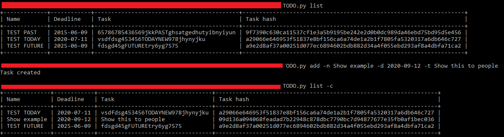

# TODO App (for terminal usage)

> Script to manage the task list through terminal

## Table of contents

- [General info](#general-info)
- [Screenshots](#screenshots)
- [Technologies](#technologies)
- [Setup](#setup)
- [Contact](#contact)

## General info

Script to manage the task list, it provides text user interface with options to list, add, edit and delete tasks.
Tasks are identified by a hash value. Script can be accessed through terminal like cmd

##### Actions

- list - list out all tasks (flags: -m, -to, -c)
- add - add new task (flags: -n, -d, -t)
- update -update task (flags: -n, -d, -t, -th)
- remove - remove task (flags: -th)

##### Flags

- -n - name of the task
- -d - deadline of the task (format: YYYY-MM-DD)
- -t - description of the task
- -th - hash to search for task
- -m - return missed tasks
- -to - return tasks for today
- -c - return current not missed tasks

## Screenshots

## Technologies

- Python - version 3.8.2
- pinenv - package

## Setup

1.  Install Python

2.  Copy files to the same directory

3.  Run this command

        pipenv install

4.  Open any terminal, and change directory to that one with files(or use created virtual env)

5.  Run program. Example:

        python todo.py add -n Show example -d 2020-09-12 -t Show this to people

_You can use this with shebang(https://www.youtube.com/watch?v=7tYEsT2dzlo)_

## Contact

Created by <b>Marek Chałabis</b> email: chalabismarek@gmail.com
