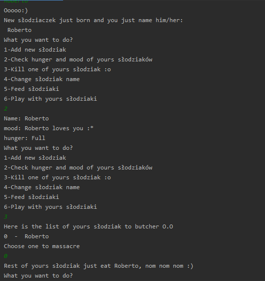

# Farma słodziaków
> Create, play, feed your own słodziak

## Table of contents
* [General info](#general-info)
* [Screenshots](#screenshots)
* [Technologies](#technologies)
* [Setup](#setup)
* [Contact](#contact)

## General info
> Program simulates the game Tamagotchi but here you can have multiple unique animals

## Screenshots

## Technologies
* Python - version 3.8.2

## Setup
1. Install Python 

2. Run/import script

## Contact
Created by <b>Marek Chałabis</b> email: chalabismarek@gmail.com
