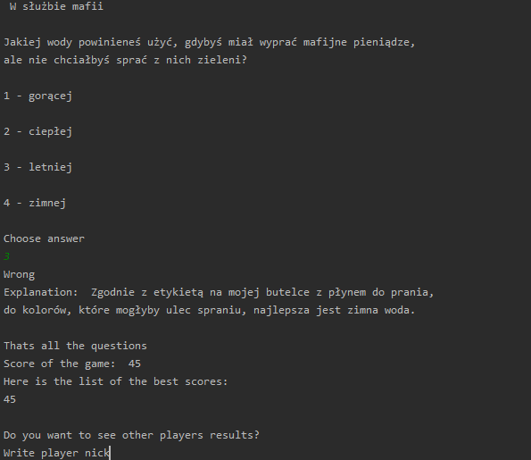

# Knowledge tournament
> Quiz game

## Table of contents
* [General info](#general-info)
* [Screenshots](#screenshots)
* [Technologies](#technologies)
* [Setup](#setup)
* [Contact](#contact)

## General info
> Program generates questions from text files, saves best scores of each player
> It saves data using shelve module
> You can add more questions just keep to the format of the txt file

## Screenshots

## Technologies
* Python - version 3.8.2

## Setup
1. Install Python 

2. Copy files into the same director

3. Run script

## Contact
Created by <b>Marek Chałabis</b> email: chalabismarek@gmail.com
