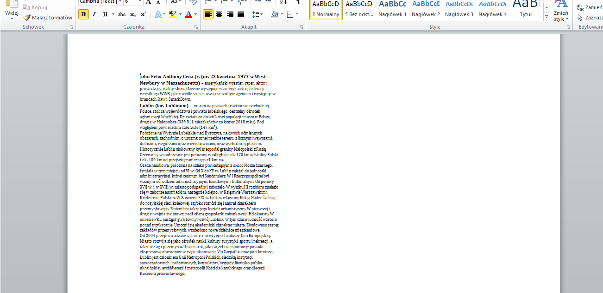

# Notes creator
> Program uses wikipedia API to get data and create custom .docx file in 2 different formats(to learn or to cheat)

## Table of contents
* [General info](#general-info)
* [Screenshots](#screenshots)
* [Technologies](#technologies)
* [Setup](#setup)
* [Contact](#contact)

## General info

> Program search given expression using wikipedia API and saves data in different formats: only definition, full context.
> You can save .docx file in 2 formats to learn or to cheat

## Screenshots

## Technologies

* Python - version 3.8.2
* wikipedia - package

## Setup

1. Install Python 

2. Install Python packages

	        pip install wikipedia 

3. Run/import script

## Contact

Created by <b>Marek Chałabis</b> email: chalabismarek@gmail.com
