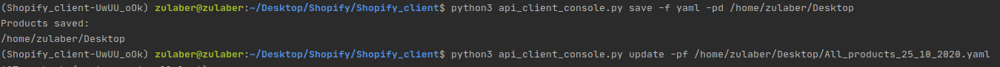

# Shopify - Client console API

> Client console API to handle Shopify API(Product section)

## Table of contents

- [General info](#general-info)
- [Screenshots](#screenshots)
- [Technologies](#technologies)
- [Setup](#setup)
- [Tests](#tests)
- [Contact](#contact)

## General info

Project that allows you to do requests on Shopify API. It Also offers console version for 2 specify actions.

[Test coverage](./tests/test_api_client.py) - 95%

#### [Class to handle Shopify Api](api_client.py)

##### Methods

- get_all_products: Returns all products in JSON format
- get_all_products_select_fields: Returns sll products filtered by fields
- update_product: Updates product by given data
- saves_all_products_by_fields: Saves all products in file(json or yaml)
- update_products_from_file: Updates products by given file

#### [Script to handle console actions](api_client_console.py)

##### save: Saves all products in file

###### Flags

-f: File format to save data REQUIRED

-pd: Path to directory to save file, default current directory

##### update: Update products by given file

###### Flags

-pf: Path to file with data REQUIRED

## Screenshots



## Technologies

- Python - version 3.8.2

## Setup

1.Install python

2.Run

```
    pip install -r requirements.txt
```

## Tests

1.Run

```
     python3 -m unittest
```

## Contact

Created by <b>Marek Chałabis</b> email: chalabismarek@gmail.com
