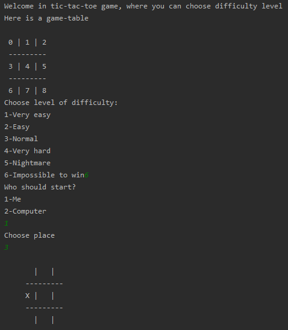

# Tic tac toe
> Tic tac toe game with different level difficulty

## Table of contents
* [General info](#general-info)
* [Screenshots](#screenshots)
* [Technologies](#technologies)
* [Setup](#setup)
* [Contact](#contact)

## General info

> Tic tac toe game with different level difficulty, you choose between 6 levels. Each level specify how "computer" will fight against you. At level 6 it is impossible to win

## Screenshots

## Technologies

* Python - version 3.8.2

## Setup

1. Install Python 

2. Run/import script

## Contact

Created by <b>Marek Chałabis</b> email: chalabismarek@gmail.com
