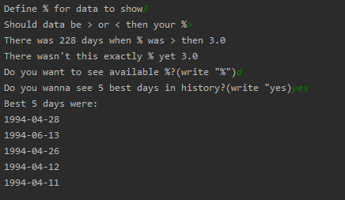

# Track polish securities
> Program tracks Polish stock exchange, shows best days, days when x% was > or < and dates when x% was specific

## Table of contents
* [General info](#general-info)
* [Screenshots](#screenshots)
* [Technologies](#technologies)
* [Setup](#setup)
* [Contact](#contact)

## General info

#### Program tracks Polish stock exchange
* define correct % for stock exchange
* filter results for > or < then given %
* show number of days when day meets criteria
* show all % that ever been recorded
* show 5 best days in history

## Screenshots

## Technologies

* Python - version 3.8.2
* requests - package
* csv - package

## Setup

1. Install Python 

2. Install Python packages

	        pip install requests csv

3. Run script

## Contact

Created by <b>Marek Chałabis</b> email: chalabismarek@gmail.com
