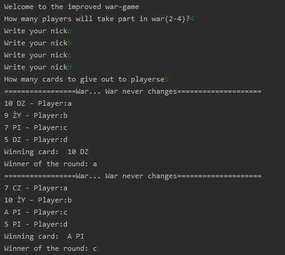
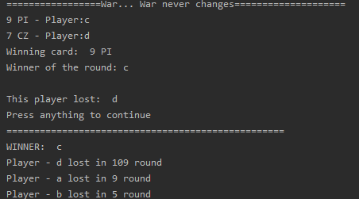

# War game auto
> Simulator of the modified war game

## Table of contents
* [General info](#general-info)
* [Screenshots](#screenshots)
* [Technologies](#technologies)
* [Setup](#setup)
* [Contact](#contact)

## General info

#### Simulator of improved war-game
* for 2-4 players
* allows to define how many cards will be given between players
* game don't allow draw if the value card is the same, colors will define victory
* after win, the player who win will take all the cards and put them to the cemetery
* if player have no more cards in hand, then his cemetery will be add to hand
* player who have no cards in hand or in cemetery will lost
* Games keep going to the point that there is only one player with cards

## Screenshots

## Technologies

* Python - version 3.8.2

## Setup

1. Install Python 

2. Run script

## Contact

Created by <b>Marek Chałabis</b> email: chalabismarek@gmail.com
