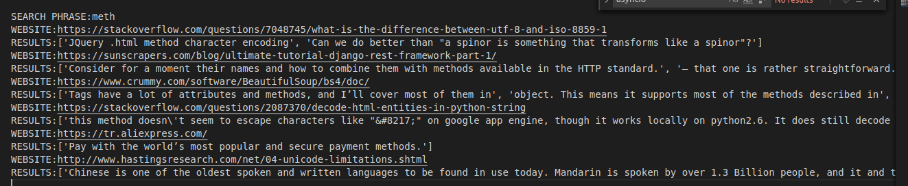

# Web scraping

> Asynchronous web scrapping

## Table of contents

- [General info](#general-info)
- [Screenshots](#screenshots)
- [Technologies](#technologies)
- [Setup](#setup)
- [Contact](#contact)

## General info

Web scraping by a given phrase in .txt file (links to websites needs to be separated by new lines). Results are save in .txt file.

Features:

- web scraping is only done on HTML tags part of website (js and CSS are excluded)

- asynchronous web scraping

* character encoding support declared by the site

* search for phrase in given HTML tags

* tests

* removes whitespace from results

## Screenshots

## Technologies

- Python - version 3.8.2
- pipenv - package

## Setup

1.  Install Python and pipenv

2.  Copy repository

3.  Install Python packages from Pipfile

            pipenv install

4.  Run/import script

## Contact

Created by <b>Marek Chałabis</b> email: chalabismarek@gmail.com
